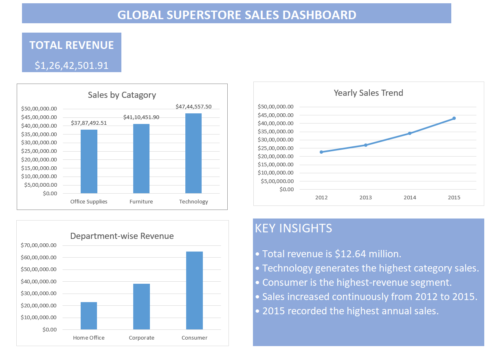

# Global Superstore Sales Dashboard

## Project Overview

This Week 1 Excel project analyzes sales performance using PivotTables and PivotCharts.

## Dashboard Measures

- Total Revenue
- Sales by Category
- Yearly Sales Trend
- Department-wise Revenue using customer segments

## Key Insights

- Total revenue is $12.64 million.
- Technology generated the highest category sales.
- Consumer was the highest-revenue segment.
- Sales increased continuously from 2012 to 2015.
- 2015 recorded the highest annual sales.

## Tools Used

- Microsoft Excel
- PivotTables
- PivotCharts
- Data summarization and visualization

## Dashboard Preview

## Excel Workbook

Download the Excel workbook from this repository:

`Debajit_Singh_Week1_Sales_Dashboard.xlsx`
